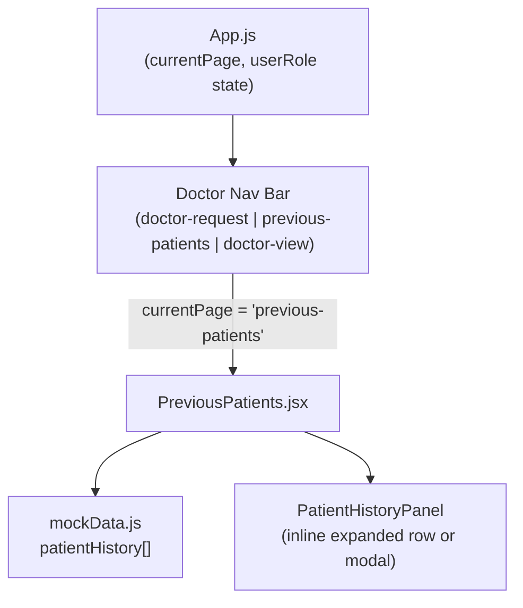

# Design Document

## Overview

The Previous Patients feature adds a new page (`PreviousPatients.jsx`) to the existing React application that gives doctors a consolidated, searchable, and filterable view of all historical patient visit records. The page follows the same structural and visual patterns as `TechnicianRequests.jsx` and `DoctorXrayRequest.jsx` — a header with search, a filter bar, a data table, and summary stat cards — while introducing a slide-in detail panel for expanded visit information.

The feature is purely frontend: it reads from a new `patientHistory` array added to `mockData.js` and requires no backend changes.

---

## Architecture

The feature integrates into the existing App.js routing model by adding a new page key (`'previous-patients'`) and a navigation entry under the `doctor` role. No new routing library is introduced.



**Data flow:**
1. App.js renders `PreviousPatients` when `userRole === 'doctor'` and `currentPage === 'previous-patients'`.
2. `PreviousPatients` imports `patientHistory` from `mockData.js` and holds derived display state locally via `useState`.
3. Search and filter logic runs as a derived computation (`useMemo` or inline filter) on every render — no external state manager needed.
4. Selecting a row sets `selectedRecord` state, which renders the `PatientHistoryPanel` as an expanded inline section below the selected row (or as an overlay panel).

---

## Components and Interfaces

### PreviousPatients (page component)

**File:** `src/pages/PreviousPatients.jsx`  
**Style:** `src/styles/PreviousPatients.css`

Props: none (receives no props from App.js — all data is imported directly from mockData).

Internal state:

| State variable | Type | Purpose |
|---|---|---|
| `searchTerm` | string | Current search input value |
| `filters` | object | Active filter values (clinic, xrayType, doctor, paymentStatus, dateFrom, dateTo) |
| `selectedRecord` | object \| null | The Visit_Record currently expanded in the detail panel |
| `activeFilterCount` | number (derived) | Count of non-empty filter values for the visual indicator |

### PatientHistoryPanel (inline sub-component)

Rendered inside `PreviousPatients.jsx` (not a separate file — keeps it simple, consistent with how other pages handle detail views inline). Receives `record` and `onClose` props.

| Prop | Type | Purpose |
|---|---|---|
| `record` | Visit_Record | The full record object to display |
| `onClose` | () => void | Callback to clear `selectedRecord` |

### Filter controls

The Filter_Bar is rendered inline within `PreviousPatients.jsx` as a collapsible row of `<select>` / `<input type="date">` elements using the existing `Select` and `Input` UI components.

### App.js changes

- Add `'previous-patients'` as a valid `currentPage` value.
- Add a navigation button in the doctor role section to switch to `'previous-patients'`.
- Render `<PreviousPatients />` when `userRole === 'doctor' && currentPage === 'previous-patients'`.

---

## Data Models

### Visit_Record (new, added to mockData.js)

```js
{
  id: string,              // e.g. "VR-001"
  patientId: string,       // e.g. "P12345"
  patientName: string,
  patientAge: number,
  patientPhone: string,
  clinicName: string,      // "Walk-in" when no referring clinic
  visitDate: string,       // ISO date "YYYY-MM-DD"
  doctor: string,          // e.g. "Dr. Mona Abdallah"
  technicianName: string,
  xrayType: string,        // matches xrayTypes names
  paymentAmount: number,   // total amount in EGP
  paymentStatus: 'paid' | 'unpaid' | 'partial',
  remainingBalance: number, // 0 when paid, full amount when unpaid
  notes: string
}
```

**Export name:** `patientHistory` — added to `src/data/mockData.js`.

Minimum 6 records covering all three `paymentStatus` values, multiple clinics, multiple doctors, and varied X-ray types.

### Filter state shape

```js
{
  clinic: '',         // empty string = no filter
  xrayType: '',
  doctor: '',
  paymentStatus: '',  // '' | 'paid' | 'unpaid' | 'partial'
  dateFrom: '',       // ISO date string or ''
  dateTo: ''          // ISO date string or ''
}
```

### Filtering logic

A record passes all filters when every active (non-empty) filter criterion matches:

- `clinic`: `record.clinicName === filters.clinic`
- `xrayType`: `record.xrayType === filters.xrayType`
- `doctor`: `record.doctor === filters.doctor`
- `paymentStatus`: `record.paymentStatus === filters.paymentStatus`
- `dateFrom`: `record.visitDate >= filters.dateFrom`
- `dateTo`: `record.visitDate <= filters.dateTo`

Search runs on top of filtered results:

- `record.patientName.toLowerCase().includes(searchTerm.toLowerCase())` OR
- `record.patientId.toLowerCase().includes(searchTerm.toLowerCase())`

Default sort: descending by `visitDate` (applied before search/filter so order is stable).

