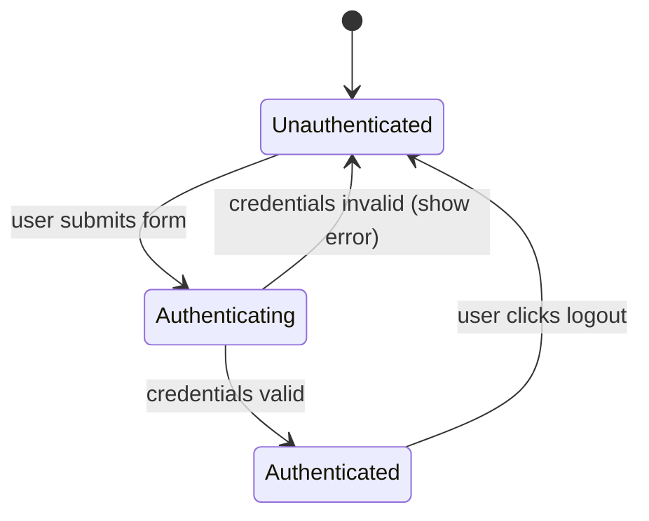
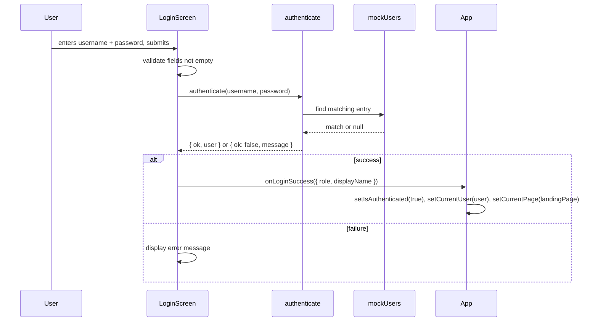

# Design Document: Role-Based Login

## Overview

This feature replaces the manual role-switcher buttons in the clinic X-ray React app with a proper login screen. Users authenticate using credentials in the format `username@role` (e.g., `ahmed@patient`, `mona@doctor`). The system validates credentials against a mock user store in `mockData.js`, sets authentication state in `App.js`, and redirects the user to the correct landing page for their role.

No real backend is involved. Authentication is frontend-only, held in React component state (no persistence across hard refresh).

### Key Goals

- Replace the role-switcher with a login flow
- Derive role from the `@role` suffix of the username
- Show the correct landing page per role after login
- Add a logout button to the top bar
- Display the authenticated user's name and role in the top bar

---

## Architecture

The feature touches three layers:

```
mockData.js          ← adds mockUsers array (data source)
src/utils/auth.js    ← authenticate() utility (pure function, no React)
src/pages/LoginScreen.jsx  ← login form UI component
App.js               ← orchestrates isAuthenticated / currentUser state
```

### State Flow



### Authentication Flow



---

## Components and Interfaces

### 1. `src/utils/auth.js` — `authenticate(username, password)`

A pure utility function with no React dependencies.

```js
// Returns { ok: true, user: { role, displayName } }
// or      { ok: false, message: string }
authenticate(username: string, password: string): AuthResult
```

Logic:
1. If `username` is empty → `{ ok: false, message: "Username is required." }`
2. If `password` is empty → `{ ok: false, message: "Password is required." }`
3. If `username` has no `@` → `{ ok: false, message: "Username must include a role suffix (e.g., ahmed@patient)." }`
4. Extract suffix after last `@`, lowercase it
5. If suffix not in `['patient', 'doctor', 'technician']` → `{ ok: false, message: "Invalid role. Use @patient, @doctor, or @technician." }`
6. Find entry in `mockUsers` where `entry.username.toLowerCase() === username.toLowerCase()` AND `entry.password === password`
7. If no match → `{ ok: false, message: "Invalid username or password." }`
8. Return `{ ok: true, user: { role: entry.role, displayName: entry.displayName } }`

### 2. `src/pages/LoginScreen.jsx`

Props:
```js
{
  onLoginSuccess: ({ role: string, displayName: string }) => void
}
```

Internal state:
- `username: string`
- `password: string`
- `error: string | null`
- `isLoading: boolean`

Renders using existing UI components (`Input`, `Button`, `Card`, `CardContent`). Matches the app's dark/light theme via Tailwind CSS variables already in use.

### 3. `App.js` changes

New state:
```js
const [isAuthenticated, setIsAuthenticated] = useState(false);
const [currentUser, setCurrentUser] = useState(null); // { role, displayName }
```

- When `isAuthenticated === false`: render `<LoginScreen onLoginSuccess={handleLoginSuccess} />` instead of the main layout
- `handleLoginSuccess({ role, displayName })`: sets `isAuthenticated`, `currentUser`, `userRole`, and `currentPage` (to the role's landing page)
- `handleLogout()`: clears `isAuthenticated`, `currentUser`, resets `currentPage` to `'patient'`
- Top bar: when authenticated, replace role-switcher with user display + logout button

### Role → Landing Page Mapping

| Role | `currentPage` value | Component |
|---|---|---|
| `patient` | `'patient'` | `PatientBooking` |
| `doctor` | `'doctor-request'` | `DoctorXrayRequest` |
| `technician` | `'technician'` | `TechnicianRequests` |

---

## Data Models

### `mockUsers` entry (added to `mockData.js`)

```js
{
  username: string,   // format: "name@role", e.g. "ahmed@patient"
  password: string,   // plain string, case-sensitive
  role: 'patient' | 'doctor' | 'technician',
  displayName: string // e.g. "Ahmed Mohamed"
}
```

Example entries:

```js
export const mockUsers = [
  { username: 'ahmed@patient',     password: 'patient123',     role: 'patient',     displayName: 'Ahmed Mohamed' },
  { username: 'mona@doctor',       password: 'doctor123',      role: 'doctor',      displayName: 'Dr. Mona Abdallah' },
  { username: 'youssef@technician',password: 'tech123',        role: 'technician',  displayName: 'Youssef Nabil' },
];
```

### `AuthResult` (returned by `authenticate()`)

```js
// Success
{ ok: true,  user: { role: string, displayName: string } }

// Failure
{ ok: false, message: string }
```

### `currentUser` state in `App.js`

```js
{ role: 'patient' | 'doctor' | 'technician', displayName: string } | null
```

